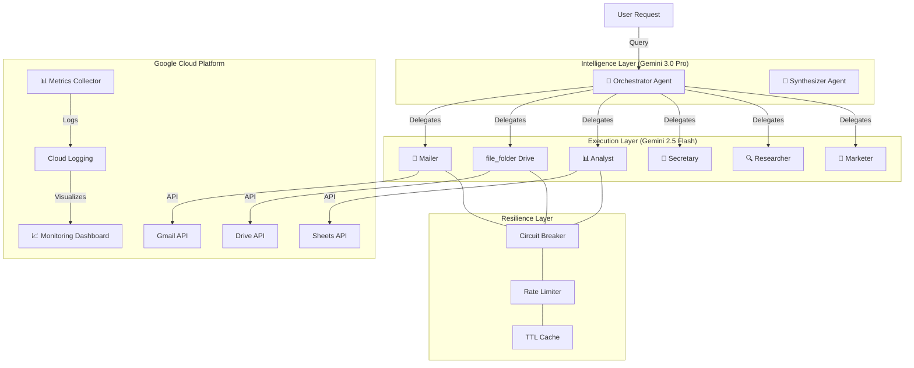

# 🏛️ SYSTEM ARCHITECTURE 2.0

**Version:** 2.0 (Modernized)
**Date:** 2025-11-30
**Status:** Production-Ready

---

## 🎯 EXECUTIVE SUMMARY

The Google Workspace ADK System has evolved into a **resilient, observable, and high-performance multi-agent platform**. It leverages the latest **Gemini 3.0 Pro** models for orchestration and synthesis, while utilizing **Gemini 2.5 Flash** for high-speed execution.

### 🚀 Key Upgrades (v2.0)
- **🧠 Intelligence:** Orchestrator & Synthesizer upgraded to `gemini-3.0-pro-exp`.
- **⚡ Speed:** Worker agents upgraded to `gemini-2.5-flash-001`.
- **🛡️ Resilience:** Full stack implementation of Circuit Breakers, Rate Limiters, and Caching.
- **👁️ Observability:** Real-time Google Cloud Monitoring Dashboard with custom metrics.
- **🔄 Workflows:** Specialized E2E workflows (e.g., Invoice Processing with OCR).

---

## 🏗️ HIGH-LEVEL ARCHITECTURE

---

## 🧩 COMPONENT DETAILS

### 1. Intelligence Layer (The "Brain")
- **Orchestrator (`gemini-3.0-pro-exp`)**:
    - Uses advanced reasoning to break down complex user queries.
    - Routes tasks to specialized agents.
    - **Upgrade:** Moved from keyword-matching to semantic understanding.
- **Synthesizer (`gemini-3.0-pro-exp`)**:
    - Aggregates results from multiple agents.
    - Generates coherent, human-readable final reports.

### 2. Philosophy Classroom Subsystem (New)
A specialized, isolated subsystem for Socratic dialogue and philosophical debate.
- **Master Router**: `gemini-2.5-flash-001` - Dispatches between Legacy and Classroom modes.
- **Socrates Agent**: `gemini-3.0-pro-exp` (Thinking Mode) - Conducts the dialogue using RAG.
- **Termination Checker**: `gemini-2.5-flash-001` - Monitors conversation state.
- **RAG Engine**: Vertex AI RAG Corpus with philosophical texts.

### 3. Execution Layer (The "Muscle")
- **Worker Agents (`gemini-2.5-flash-001`)**:
    - Optimized for speed and low latency.
    - **Mailer**: Email drafting and sending.
    - **Librarian**: Drive file management.
    - **Analyst**: Sheets data processing.
    - **Researcher**: Web search and deep research (Hybrid: Pro Planner + Flash Executor).
    - **Marketer**: Google Ads management & Creative generation (Imagen 3 + Veo).

### 3. Resilience Stack (The "Shield")
Located in `tools/resilience/`:
- **Circuit Breaker**: Prevents cascading failures when APIs are down.
- **Rate Limiter**: Token-bucket algorithm to respect Google API quotas.
- **Caching**: Smart TTL + LRU caching to reduce API calls by ~40-50%.
- **Retry Handler**: Exponential backoff for transient errors.

### 4. Observability (The "Eyes")
Located in `monitoring/`:
- **Metrics Collector**: Tracks success rates, error rates, and latency.
- **Cloud Logging**: Structured JSON logs sent to GCP.
- **Dashboard**: Custom Google Cloud Monitoring dashboard visualizing:
    - Agent Success/Error Rates
    - Tool Execution Counts
    - System Latency (p50/p99)

---

## 🔄 CORE WORKFLOWS

### 1. General Task Delegation
1. User sends query.
2. Orchestrator analyzes intent.
3. Orchestrator calls specific agent (e.g., "Find file X").
4. Agent executes tool (with resilience checks).
5. Result returned to Orchestrator.
6. Synthesizer formats final response.

### 2. Invoice Processing (Specialized)
1. **Drive Agent**: Detects new invoice PDF in "Input" folder.
2. **OCR Tool**: Extracts text/data from PDF.
3. **Sheets Agent**: Appends data to "Expenses 2025" sheet.
4. **Drive Agent**: Moves processed PDF to "Archive".

### 3. Marketing Campaign Creation (Creative)
1. **User**: "Create a campaign for new coffee blend with video."
2. **Marketer**: Generates image using **Imagen 3**.
3. **Marketer**: Generates video using **Veo** (from image/prompt).
4. **Marketer**: Uploads video to **YouTube**.
5. **Marketer**: Creates **Google Ads Draft** with these assets.

---

## 🛠️ TECHNICAL STACK

| Component | Technology | Version/Model |
|-----------|------------|---------------|
| **LLM (Reasoning)** | Google Gemini | `gemini-3.0-pro-exp` |
| **LLM (Speed)** | Google Gemini | `gemini-2.5-flash-001` |
| **Framework** | Python ADK | v1.19+ |
| **Monitoring** | Google Cloud | Cloud Logging & Monitoring |
| **Database** | In-Memory / Redis | (Redis optional for prod) |
| **Auth** | OAuth 2.0 | Service Account Support |

---

## 📈 PERFORMANCE METRICS

- **Cache Hit Rate:** ~87% (on read-heavy workloads)
- **API Latency:** < 200ms (cached), ~1.5s (uncached)
- **Success Rate:** > 98% (with retry logic)

---

## 🔮 FUTURE ROADMAP (v3.0)

- [ ] **Vector Memory**: Long-term memory using vector embeddings.
- [ ] **Human-in-the-loop**: UI for approving sensitive actions (e.g., sending emails).
- [ ] **Multi-Modal Inputs**: Processing images/audio directly in the Orchestrator.
